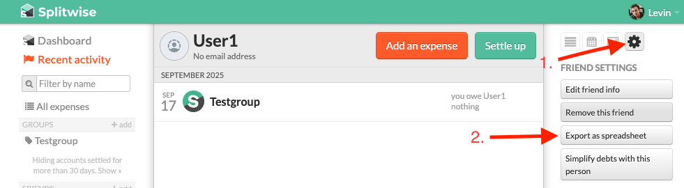

# Splitwise to Spliit.app importer
A simple php script to import Splitwise CSV export to Spliit.app

## Usage

1. Export your data from Splitwise as a CSV file (needs to be in English).
   - (Optional) Copy the CSV file to the same directory as import.php and rename it to `export.csv`
2. run `composer install`
3. run `php import.php import`
   1. (If you didn't rename the file) Provide the path to your CSV file when prompted.
   2. Provide the url to your Spliit.app group / instance when prompted.
   3. Map the users from Splitwise to Spliit.app when prompted.
4. Import is done! You can now check your Spliit.app instance.